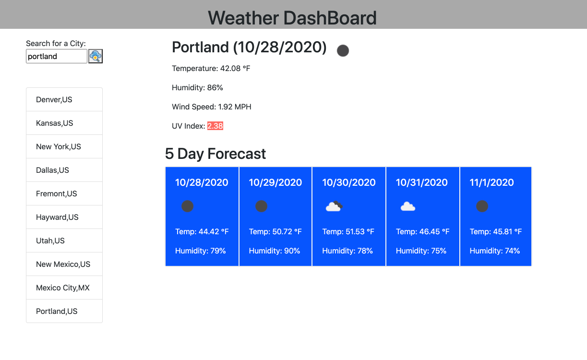

# weather-dashboard

Welcome to the weather Dashboard. Here the user will be able to search for the city anywhere in the world and recieve Today's forcast and the 5 day forecast. We also list out you 10 most recent searches. we are using Open Weather Api to make multiple calls. We make three Api calls to get all the following information on the page. 

## Today's Forecast

<ul>
    <li>City name, today's date and a weather icon</li>
    <li>Temperature</li>
    <li>Humidity</li>
    <li>UV Index - which will change backgorund color depending on the number that comes back</li>
</ul>

## Future Forecast
Will display 5 cards that show 
<ul>
    <li>Future Date</li>
    <li>Relevant weather Icon </li>
    <li>Temperature</li>
    <li>Humidity</li>
</ul>

## Search History
We will display you 10 most recent searches. You can also click on any one of the searches to see the updated result. 

## technologies Used
<ul>
    <li>HTML/CSS/Javascript</li>
    <li>Bootstrap </li>
    <li>JQuery</li>
    <li>Open Weather API
    </li>
</ul>

## Screenshot

Icons made by <a href="https://www.flaticon.com/authors/prosymbols" title="Prosymbols">Prosymbols</a> from <a href="https://www.flaticon.com/" title="Flaticon"> www.flaticon.com</a>

